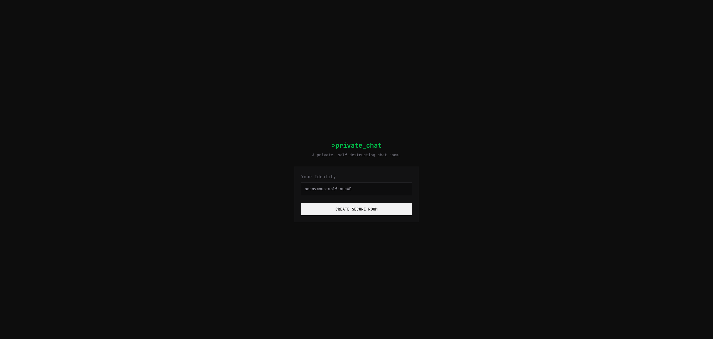
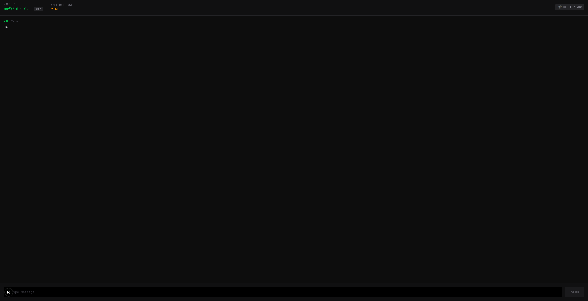

# 💬 private_chat

A lightning-fast, responsive real-time private chat application. Built with end-to-end type safety using Next.js 16, ElysiaJS, and Upstash.

## 🚀 Features

* **Real-Time Messaging**: Instant message delivery powered by Upstash Realtime.
* **End-to-End Type Safety**: Seamless API integration and type inference between Next.js and ElysiaJS using Eden.
* **Modern UI**: Styled with Tailwind CSS v4 for a clean, fully responsive design.
* **Optimized Data Fetching**: Powered by React Query for efficient server state management and caching.
* **Fast & Edge-Ready**: Built on the bleeding edge with Next.js 16, React 19, and the React Compiler.

---

## 📸 Screenshots

> *Note: Replace these placeholder paths with your hosted image URLs or repository assets.*






---

## 🛠️ Tech Stack

* **Frontend:** Next.js 16, React 19, `@tanstack/react-query`, Tailwind CSS v4
* **Backend:** ElysiaJS, Zod (Validation)
* **Database & Realtime:** Upstash Redis, Upstash Realtime
* **Tooling:** TypeScript, ESLint, React Compiler, `date-fns`, `nanoid`

---

## 💻 Getting Started

### Prerequisites

Ensure you have **Node.js** installed on your machine. You will also need an **Upstash Redis** database to handle messaging and state.

### Installation

1. Clone the repository and navigate to the project directory:
   ```bash
   git clone [https://github.com/your-username/private_chat.git](https://github.com/your-username/private_chat.git)
   cd private_chat

```

2. Install the dependencies using your preferred package manager:
```bash
npm install
# or
pnpm install
# or
yarn install

```


3. Set up your environment variables. Create a `.env.local` file in the root directory and add your Upstash credentials:
```env
UPSTASH_REDIS_REST_URL="your-upstash-redis-url"
UPSTASH_REDIS_REST_TOKEN="your-upstash-redis-token"

```


### Running the Development Server

Start the development server locally:

```bash
npm run dev
# or
pnpm dev
# or
yarn dev

```

Open [http://localhost:3000](https://www.google.com/search?q=http://localhost:3000) in your browser to view the application.

---

## 📜 Available Scripts

You can run the following commands in the project directory:

| Command | Description |
| --- | --- |
| `npm run dev` | Starts the Next.js development server with hot-reloading. |
| `npm run build` | Builds the application for production deployment. |
| `npm run start` | Starts the production server after the build completes. |
| `npm run lint` | Runs ESLint to check for code quality and formatting issues. |

```

```